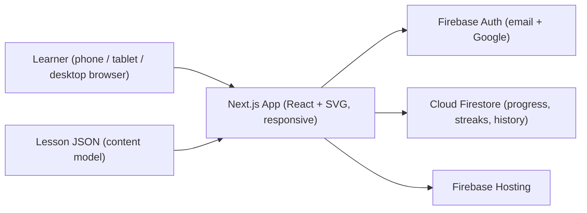

# Product Requirements Document — Algebra Learn-by-Doing App

**Subject:** Algebra
**Phase covered by this PRD:** Phase 1 (MVP) only — no AI features
**Last updated:** 2026-06-22

---

## 1. Overview

A learn-by-doing algebra app for middle school students, modeled on Brilliant. There are no videos and no walls of text. Every lesson drops the learner into an interactive problem, lets them poke at it, gives instant and specific feedback, and only then reveals the idea behind it. The product follows Brilliant's signature pedagogy: **pretest before teaching** (let the learner attempt before explaining), **one concept per lesson**, and **misconception-aware feedback** instead of a bare red X.

This PRD scopes **Phase 1 only**: a single, deep, genuinely great lesson that teaches a real algebra concept through hands-on manipulation, with no AI doing any of the work. The guiding principle from the project spec: if the app does not teach without AI, no AI will save it.

The one MVP lesson is the **Balance Scale** lesson — "What is a variable, and what does it mean to keep an equation balanced?" — chosen because a balance scale makes the abstract idea of equality concrete and is fully teachable through direct manipulation.

---

## 2. User Personas

### Primary — "Maya," 12, 7th grader
- **Context:** Learns on a phone, often in short 5-to-10-minute sessions (bus, couch, between classes). Touch input, small screen.
- **Background:** Comfortable with arithmetic. New to variables; the leap from numbers to letters feels intimidating.
- **Goals:** Understand what `x` actually means; feel like she "gets it" rather than memorizing steps; feel a sense of progress.
- **Pain points:** Low frustration tolerance. A red X with no explanation makes her shut down. Walls of text lose her. She needs to feel safe getting things wrong.
- **What success looks like for Maya:** She gets a problem wrong, the feedback tells her *why* in one sentence, she fixes it herself, and the concept clicks.

### Primary — "Leo," 13, 8th grader on a laptop
- **Context:** Learns at a desk on a laptop/desktop, often for longer sittings (homework time, a quiet study block). Mouse and keyboard, large screen.
- **Background:** Comfortable with arithmetic; uses the bigger screen to slow down and really look at the visual.
- **Goals:** Use the extra screen space to experiment with the balance scale deliberately; type answers quickly with the keyboard.
- **Pain points:** A layout that only feels designed for phones (tiny touch targets stretched across a wide screen) feels awkward; he expects drag with a mouse and keyboard entry to work naturally.
- **What success looks like for Leo:** Drag-and-drop works precisely with a mouse, keyboard input is supported where it makes sense, and the layout uses the wider screen well without breaking.

### Primary — "Aisha," 12, 6th grader on a tablet
- **Context:** Learns on a tablet (often in landscape), at home or in class. Touch input, medium-to-large screen, sometimes with a case/stand.
- **Background:** New to variables, like Maya; the larger touch surface makes dragging tiles feel comfortable and game-like.
- **Goals:** Manipulate the balance scale with her fingers on a roomy screen; switch between portrait and landscape without the layout breaking.
- **Pain points:** Interactions sized only for a small phone feel cramped; accidental scrolling while dragging is frustrating; layout that doesn't adapt to landscape wastes space.
- **What success looks like for Aisha:** Touch drag is smooth and forgiving, the visual scales up to fill the tablet screen, and both orientations work.

### Secondary — "Sam," 12, the learner who often gets it wrong
- **Context:** Same age and mobile-first context as Maya, but consistently misses problems on the first (and sometimes second and third) try.
- **Background:** Genuinely confused by the number-to-variable leap; tends to make the same class of mistake repeatedly (for example, changing one side of the scale but not the other).
- **Goals:** Recover from mistakes without feeling dumb; understand *why* an answer was wrong, not just that it was.
- **Pain points:** A bare red X makes him give up. Generic "try again" messages don't help. Repeating the exact same wrong answer with no new guidance is demoralizing.
- **What success looks like for Sam:** Each wrong answer returns a specific, one-line explanation tied to his actual mistake; after repeated misses the app surfaces a hint or an easier step before moving on; he ends the lesson having recovered on his own. (Sam is the persona the feedback system must be designed for.)

### Secondary — Parent or teacher
- **Context:** Wants the learner to make consistent, low-pressure progress; may sit alongside them occasionally.
- **Goals:** See that the app actually teaches (not just gamified busywork) and that the learner comes back.
- **Pain points:** Skeptical of edtech that is all streaks and no substance.

---

## 3. MVP Definition

The MVP is judged on whether **one lesson actually teaches** the concept without any AI. Depth over breadth.

### 3.1 Necessary features (the hard gate)

- **One deep lesson — Balance Scale:** teaches "what is a variable / keeping an equation balanced" as a short sequence of interactive steps (a few minutes to complete).
- **Structured content model:** the lesson is authored as a JSON sequence of typed steps (`concept`, `problem`, `feedback`), never an HTML blob. This is what lets us add lessons fast later and lets AI generate them in Phase 2.
- **Direct-manipulation problem:** the learner drags number tiles onto the pans of a balance scale to make both sides equal (beyond multiple choice).
- **Responsive SVG visual:** the scale tips and levels in real time as tiles are added or removed, staying smooth (60 FPS target). The visual scales to fill the available space on phone, tablet, and desktop.
- **Instant, specific feedback (<100ms):** hand-written, keyed to common wrong answers / misconceptions (for example, "you balanced the numbers but not the sides" or "both pans must hold the same total"). Wrong answers get a short explanation, not just a red X. The concept reveal also shows after correct answers.
- **Fully responsive, multi-device layout (equal priority):** phone, tablet, and desktop are all first-class. The layout adapts fluidly across breakpoints and orientations (portrait and landscape), with no device treated as an afterthought.
- **Multi-input support:** every interaction works with **touch** (phone/tablet), **mouse** (desktop drag-and-drop), and **keyboard** where it makes sense (answer entry, navigation). Drag interactions are forgiving and must not trigger accidental page scrolling.
- **Robust progress persistence:** progress is saved continuously at the step level and survives refreshes, closed tabs, and switching devices mid-lesson. A learner can start on a phone, continue on a tablet, and finish on a laptop, resuming exactly where they stopped — including the in-progress state of a problem, the streak, and answer history.
- **Auth with accounts and names:** Firebase Auth (email/password + Google sign-in). The app greets the learner by name.
- **Habit loop:** a daily streak and a satisfying lesson-completion milestone.
- **Deployed and public:** hosted on Firebase Hosting, reachable by anyone, holding up with multiple concurrent learners.

### 3.2 Explicitly excluded from the MVP (deferred to later phases)

- **All AI features** — no chatbot tutor, no model calls, no generated content, no AI hints. (Phase 2)
- **Lessons 2–3** (Keep both sides equal; Solve by isolating the variable) — documented in [lessons.md](lessons.md) but not built for the MVP. They extend the same balance-scale big concept. (Post-MVP / Phase 1 stretch)
- **Full course-path graph** with prerequisite unlocking across many lessons. The MVP shows a sensible single "next step" recommendation only.
- **Spaced repetition, interleaving, and mastery-gating** as formal systems. (Phase 3)
- **Leagues, XP economy, and social features.**

### 3.3 Non-goals

- Breadth across many subjects — this is algebra, taught deeply, for one audience (middle schoolers) across their devices.
- Video content of any kind.
- Social / multiplayer / leaderboard features.

---

## 4. User Stories

Each story maps to the MVP testing scenarios in the project spec.

### Learning
- As a learner, I want to be dropped into a problem before being told the rule, so that I build intuition by trying first.
- As a learner, I want each lesson to focus on one idea in plain language, so that I am not overwhelmed.
- **Acceptance:** the lesson presents a problem step before its concept reveal; a learner who knows little can complete it and come away understanding equality/variables.

### Interaction and visuals
- As a learner, I want to drag number tiles onto a balance scale and watch it tip or level, so that I can experiment and see the effect of my actions.
- **Acceptance:** dragging a tile updates the scale visual in real time; the visual stays smooth (60 FPS) during manipulation; works with touch.

### Feedback
- As a learner, I want instant, specific feedback when I answer, so that a wrong answer teaches me instead of just marking me wrong.
- **Acceptance:** feedback appears in under 100ms; at least the common wrong answers produce a tailored one-line explanation; a learner can use the feedback to recover and get it right.

### Progress and persistence
- As a learner, I want to leave mid-lesson and return later (even on another device) and pick up where I left off, so that I never lose progress.
- As a learner, I want my progress saved automatically as I go, so that a refresh, a closed tab, or a dropped connection never costs me my place.
- As a learner, I want to start on my phone and continue on a tablet or laptop, so that I can learn on whatever device is nearby.
- **Acceptance:** step-level progress (including in-progress problem state), streak, and answer history persist across sessions and devices via the learner's account; progress is written continuously, not only at lesson end; resuming on a different device restores the exact step.

### Habit
- As a learner, I want a daily streak and a satisfying completion moment, so that I come back tomorrow.
- As a learner, I want to see what to do next when I finish, so that the path feels like it knows where I am.
- **Acceptance:** finishing the lesson increments the streak, shows a milestone, and recommends a sensible next step.

### Auth
- As a learner, I want to create an account and be greeted by name, so that my progress is mine.
- **Acceptance:** email/password and Google sign-in both work; the learner's name is shown in-app.

### Responsive, multi-device experience
- As a learner on a phone, I want the experience to work well on a small touch screen, so that I can learn anywhere in short sessions.
- As a learner on a tablet, I want the visual to scale up and work in portrait and landscape with comfortable touch targets, so that dragging tiles feels natural.
- As a learner on a desktop/laptop, I want precise mouse drag-and-drop and keyboard input, with a layout that uses the wider screen well, so that the app feels built for my device too.
- **Acceptance:** layout adapts fluidly across phone, tablet, and desktop breakpoints and both orientations; touch, mouse, and keyboard inputs all work; drag never causes accidental scrolling; first interaction is ready in under 2 seconds on each device class.

---

## 5. Tech Stack

### Frontend
- **Next.js (React)** with **TypeScript**.
- **SVG + React** for interactive visuals (balance scale), chosen for lightweight, precise pointer handling (touch + mouse) and easy 60 FPS updates without a heavy canvas library. SVG scales cleanly across screen sizes.
- **Pointer Events** (unified touch + mouse) for drag interactions, so the same code path serves phone, tablet, and desktop.
- **Tailwind CSS** (suggested) for fast, responsive styling with mobile, tablet, and desktop breakpoints.

### UI look and feel
- The UI should follow a **color theme similar to Brilliant.org**: a clean, modern, dark-first palette built around a deep navy/charcoal background with high-contrast white text, plus a small set of bright accent colors for interaction.
- Suggested usage: a **bright green** for correct/success states and primary call-to-action buttons, a **calmer blue/teal** for interactive elements and the balance-scale visual, and a **warm amber/orange (not harsh red)** for "not yet / try again" feedback so wrong answers feel safe rather than punishing.
- Generous spacing, large rounded touch targets, and a friendly, playful-but-focused tone — minimal chrome so the interactive problem and visual are the focus, matching Brilliant's "intellectual play" aesthetic.
- Define the palette as theme tokens (Tailwind theme / CSS variables) so it stays consistent across components and is easy to tune.

### Backend / data
- **Firebase Auth** — email/password + Google sign-in.
- **Cloud Firestore** — stores users (name), per-lesson and per-step progress, streaks, and answer history.

### Content
- **JSON lesson format** so lessons can be added without rewriting code, and so AI can generate them later. Sketch of the schema:

```json
{
  "id": "balance-scale",
  "title": "What is a variable?",
  "steps": [
    {
      "type": "concept",
      "body": "Short intuition-building text or visual setup."
    },
    {
      "type": "problem",
      "prompt": "Drag tiles so both sides balance.",
      "interaction": "drag-balance",
      "validator": { "kind": "sides-equal" },
      "feedback": {
        "correct": "Balanced! Both sides hold the same total.",
        "byMistake": {
          "one-side-only": "You added to one pan only — both sides must match.",
          "numbers-not-sides": "Check the totals: each pan must hold the same amount."
        },
        "default": "Not balanced yet — compare the totals on each pan."
      }
    }
  ]
}
```

### Hosting / deployment
- **Firebase Hosting** (public, supports multiple concurrent learners).

### Future (Phase 2 / Phase 3 — noted, not built in MVP)
- **OpenAI or Anthropic Claude** for generated practice problems and targeted hints, grounded in the lesson's structured JSON state (not raw text).
- A **math engine (math.js or SymPy)** for ground-truth checks so AI never gives a wrong answer.

### Data flow



---

## 6. Success Metrics

### Performance targets (from the spec — tested on the deployed app)
- Feedback on an answer appears in **under 100ms**.
- Interactive visual stays smooth at **60 FPS** while manipulated, on all device classes.
- Lesson loads to first interaction in **under 2 seconds**.
- Works equally well on **phone, tablet, and desktop**, across portrait and landscape, with **touch, mouse, and keyboard** input.
- Progress persists continuously and resumes correctly **across sessions and devices** (start on one device, continue on another).
- Holds up with **multiple concurrent learners** with no slowdown.

### Learning and engagement metrics
- **Lesson completion rate** — percentage of learners who start and finish the lesson.
- **Recover-after-wrong-answer rate** — percentage of learners who get a problem wrong, then get it right (signals feedback is working).
- **Return / streak rate** — percentage of learners who come back the next day; average streak length.
- **Time-to-first-interaction** — how quickly a new learner is actually doing something.

### MVP pass criteria checklist (hard gate)
- [ ] Subject stated clearly, app built for a specific persona.
- [ ] One interactive lesson on a real concept, built around hands-on problems (not video or text).
- [ ] At least one problem the learner manipulates directly.
- [ ] An interactive visual that responds.
- [ ] Instant, specific, hand-written feedback on each answer.
- [ ] Progress persists continuously; resume mid-lesson across sessions and devices.
- [ ] Accounts and names (auth).
- [ ] Fully responsive on phone, tablet, and desktop, with touch, mouse, and keyboard input.
- [ ] Deployed and public.
- [ ] No AI features anywhere in the MVP.

---

## 7. Open Questions and Assumptions

- **Auth providers:** assumed email/password + Google (matches Brilliant and Firebase defaults). Apple sign-in could be added later.
- **MVP lesson count:** assumed **one** deep lesson (Lesson 1 — "A level scale means equal") for the Phase 1 gate; Lessons 2–3 from [lessons.md](lessons.md), which extend the same balance-scale big concept, are the immediate post-MVP roadmap.
- **Visual library:** assumed plain SVG + React; revisit if a future lesson (for example, dense graphing animation) needs Canvas/Konva.
- **Next-step recommendation:** for the MVP this is a single hard-coded sensible suggestion; it becomes a real path/mastery system in later phases.
